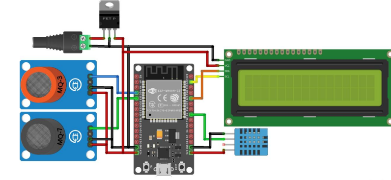
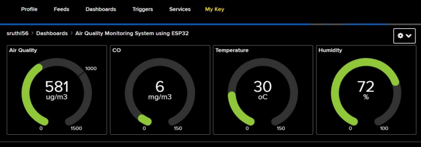
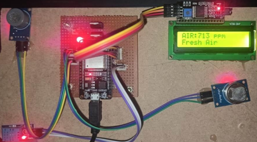
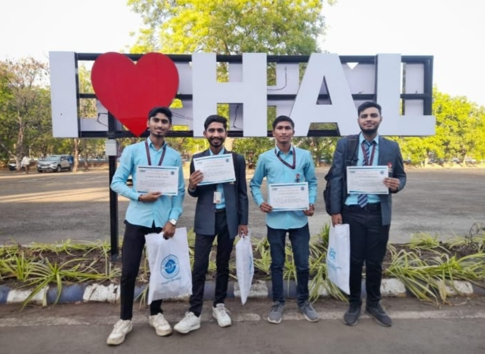

# 🌍📊 Air Quality Monitoring and Pollution Control System

## 🏆 Project Highlight
**Presented at a Technical Exhibition organized at :Hindustan Aeronautics Limited (HAL).**

---

## 📌 Overview
The Air Quality Monitoring and Pollution Control System is an environmental monitoring project designed to detect harmful air pollutants and assess air quality in real time. The system aims to create awareness about pollution levels and support timely preventive actions for improved environmental and public health safety.

This project was developed and demonstrated during a technical exhibition at HAL, providing valuable exposure to industry-level evaluation and technical presentation.

---

## ✨ Key Features
- Real-time air quality monitoring  
- Detection of harmful gases and pollutants  
- Audio/visual alert indication on unsafe air levels  
- Low-cost and scalable system design  
- Suitable for industrial, urban, and public environments  

---

## 🛠️ Components & Technologies
- Air Quality / Gas Sensors (MQ Series)  
- Microcontroller (ESP 32)
- Embedded C / Arduino Programming  
- Alert mechanisms (LED / Buzzer)  
- Environmental monitoring concepts  

---

## ⚙️ Working Principle
1. Air quality sensors continuously monitor surrounding air.
2. Sensor outputs are processed by the microcontroller.
3. Pollution levels are compared against predefined safe thresholds.
4. When unsafe levels are detected:
   - Alerts are generated to indicate hazardous conditions.
5. The system supports awareness and timely corrective actions.

---

## 💻 Code
All source code related to sensor interfacing and alert logic is available in the `code` folder.

---

## 🖼️ Project Visuals
## 🖼️ Project Visuals

### 🔹 Circuit Connection Diagram
This diagram shows the complete hardware connections between the ESP32, air quality sensor, and alert components.

---

### 🔹 Dashboard – Air Quality Parameters
The dashboard displays real-time air quality parameters captured by the system for monitoring and analysis.

---

### 🔹 Final Working Model
The fully assembled and operational air quality monitoring system during live testing.

---

### 🔹 HAL Exhibition – Team & Project Recognition
Team presentation and project showcase at the HAL technical exhibition, including certificates and project materials received after evaluation.

---

## 🚀 Future Scope
- IoT-based cloud monitoring dashboard  
- GSM/WiFi-based real-time alerts  
- Data logging and pollution trend analysis  
- Integration with smart city infrastructure  

---

## 📜 License
This project is open-source and available under the MIT License.
